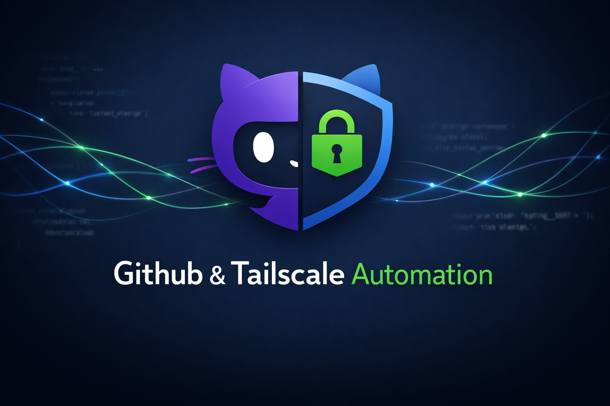
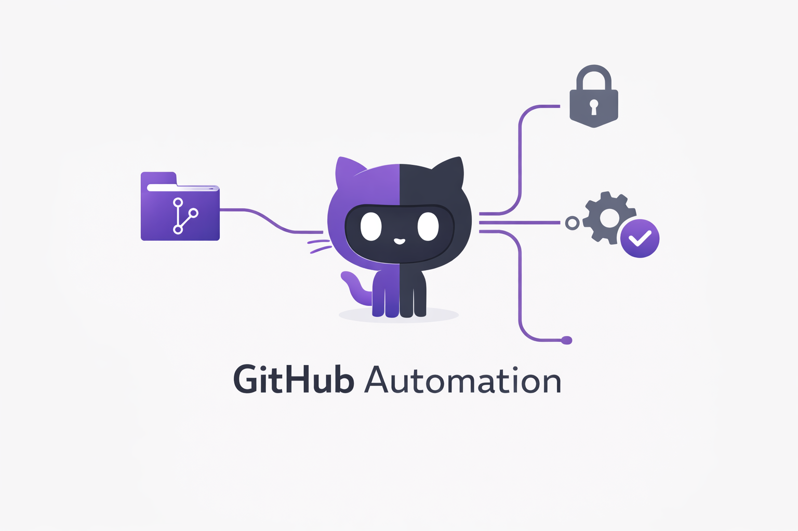
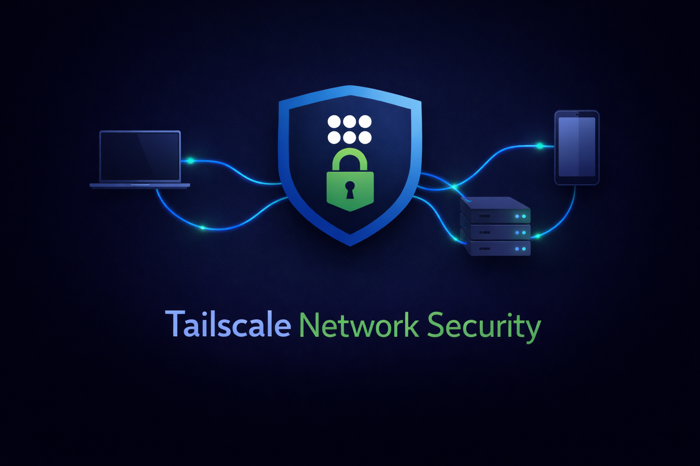
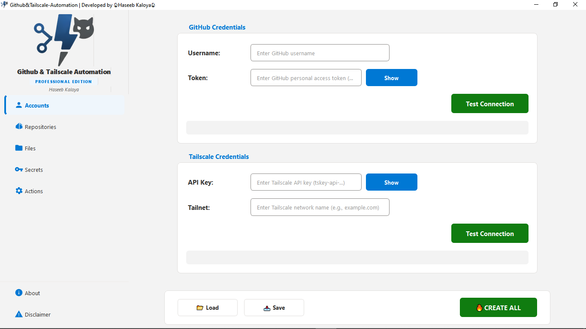
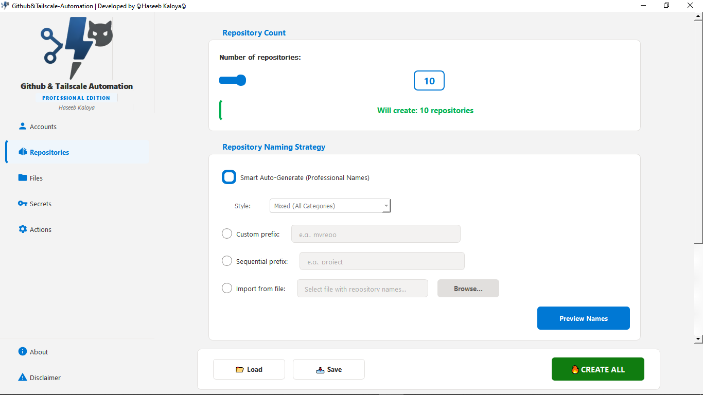
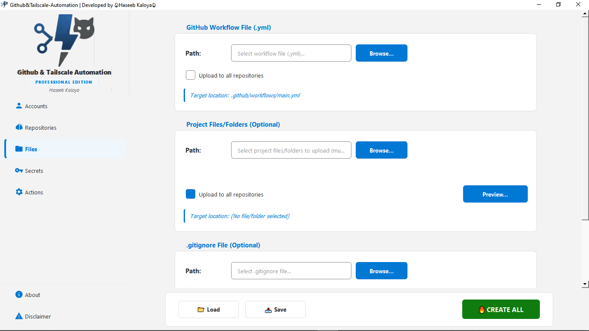
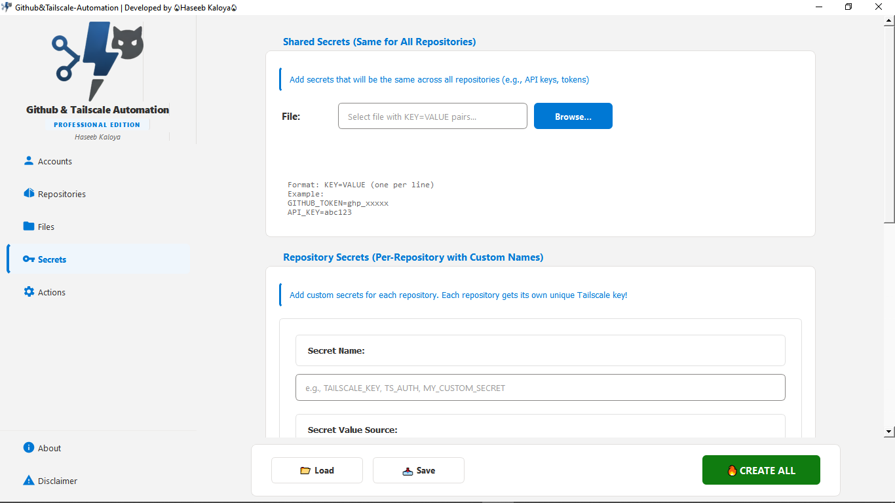

# Github & Tailscale Automation



<p align="center">
  <a href="https://opensource.org/licenses/MIT">
    
  </a>
  <a href="https://www.python.org/downloads/">
    
  </a>
  <a href="https://github.com/haseebkaloya/Github-Tailscale-Automation/actions/workflows/ci.yml">
    
  </a>
  <a href="https://github.com/haseebkaloya/Github-Tailscale-Automation/stargazers">
    
  </a>
  <a href="https://github.com/haseebkaloya/Github-Tailscale-Automation/network/members">
    
  </a>
  <a href="https://github.com/haseebkaloya/Github-Tailscale-Automation/issues">
    
  </a>
  <a href="https://codecov.io/gh/haseebkaloya/Github-Tailscale-Automation">
    
  </a>
</p>

A professional-grade GUI platform for automating GitHub repository management and Tailscale network security operations.

---

## Table of Contents

*   [Overview](#overview)
*   [Features](#features)
*   [Getting Started](#getting-started)
*   [Releases](#releases)
*   [Screenshots](#screenshots)
*   [Configuration](#configuration)
*   [Project Structure](#project-structure)
*   [Contributing](#contributing)
*   [License](#license)

---

## Overview

**Github & Tailscale Automation** is a desktop application designed to streamline DevOps workflows by providing a unified interface for:

*   **GitHub Management**: Bulk repository creation, secret encryption, and workflow automation.
*   **Tailscale Operations**: Generation of reusable or ephemeral auth keys for secure mesh networking.

Built with Python and PyQt5, it offers a modern, responsive interface for developers, system administrators, and DevOps engineers managing infrastructure at scale.

---

## Features

For a detailed breakdown of all features, see the **[Features Documentation](docs/FEATURES.md)**.

### GitHub Automation



*   **Bulk Repository Creation**: Initialize multiple repositories with custom settings (Issues, Wiki, Projects).
*   **Secret Management**: Securely encrypt and upload secrets to repositories.
*   **Workflow Triggers**: Manually trigger GitHub Actions workflows from the dashboard.
*   **File Management**: Upload standard files (e.g., `.gitignore`, `LICENSE`) across multiple repositories.

### Tailscale Integration



*   **Auth Key Generation**: Generate keys with specific capabilities (reusable, ephemeral, pre-authorized).
*   **Tag Management**: Automatically apply ACL tags to generated keys.
*   **Expiry Control**: Set custom expiration policies for generated keys.

### System & Diagnostics

*   **Real-time Diagnostics**: Built-in system health checks for network and dependencies.
*   **Robust Logging**: Comprehensive logging for auditing and troubleshooting.
*   **Secure Configuration**: Encrypted storage for sensitive API tokens.

---

## Getting Started

### Prerequisites

*   Python 3.10 or higher
*   A GitHub Personal Access Token with `repo` and `workflow` scopes.
*   A Tailscale API Key.

### Installation

1.  **Clone the repository:**

    ```bash
    git clone https://github.com/haseebkaloya/Github-Tailscale-Automation.git
    cd Github-Tailscale-Automation
    ```

2.  **Create a virtual environment and install dependencies:**

    ```bash
    python -m venv venv
    # On Windows
    venv\Scripts\activate
    # On macOS/Linux
    source venv/bin/activate
    ```

    ```bash
    pip install -r requirements.txt
    ```

3.  **Run the application:**

    ```bash
    python main.py
    ```

---

## Releases

For users who prefer not to run the application from the source code, we provide pre-compiled executables for Windows.

1.  **Navigate to the [Releases Page](https://github.com/haseebkaloya/Github-Tailscale-Automation/releases)** on the right side of the repository page.
2.  **Download the latest `.exe` file** from the "Assets" section of the most recent release.
3.  **Run the executable** directly on your machine. No installation is required.

---

<details>
<summary>🖼️ Click to view Screenshots</summary>
<br>

| Dashboard | Repository Manager |
| :---: | :---: |
|  |  |
| *Real-time System Diagnostics* | *Bulk Repository Creation Interface* |

| Tailscale | Configuration |
| :---: | :---: |
|  |  |
| *Secure Key Generation* | *API Token Management* |

</details>

---

## Configuration

On first launch, navigate to the **Accounts** tab to configure your credentials:

1.  **GitHub Token**: Generate one at [GitHub Developer Settings](https://github.com/settings/tokens).
2.  **Tailscale API Key**: Generate one at the [Tailscale Admin Console](https://login.tailscale.com/admin/settings/keys).

Configuration is stored locally in `configs/config.json` and is excluded from version control by `.gitignore`.

---

<details>
<summary>📂 Click to view Project Structure</summary>
<br>

The project follows a modular architecture:

*   `core/`: Main application logic and window management.
*   `api/`: Wrappers for the GitHub and Tailscale APIs.
*   `gui/`: PyQt5 widgets, dialogs, and styling components.
*   `utils/`: Helper functions for logging, path management, and security.

</details>

---

## Contributing

Contributions are welcome. Please see [CONTRIBUTING.md](CONTRIBUTING.md) for details on how to submit pull requests, report issues, and suggest improvements.

---

## License

This project is licensed under the MIT License. See the [LICENSE](LICENSE) file for details.

---

## Author

*   **Haseeb Kaloya**
    *   **Email**: [haseebkaloya@gmail.com](mailto:haseebkaloya@gmail.com)
    *   **Telegram**: [t.me/haseebkaloya](https://t.me/haseebkaloya)
    *   **Contact**: +92 345 1622556
